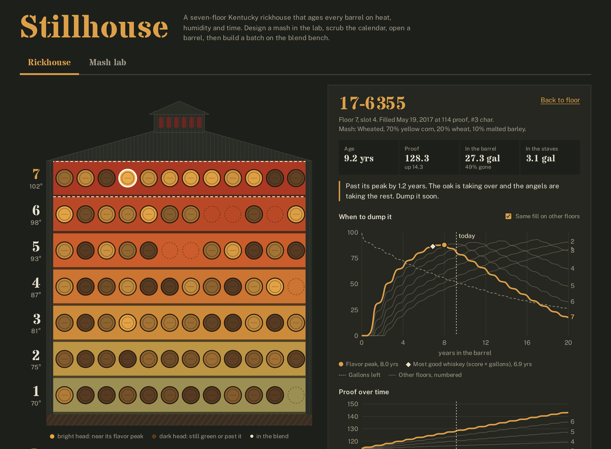
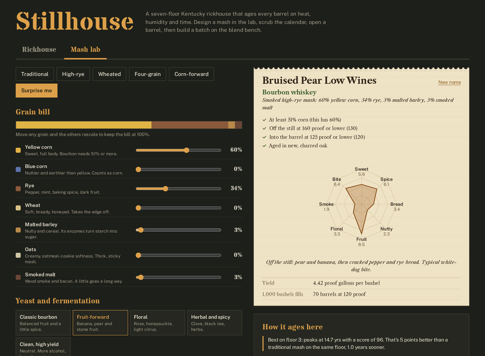
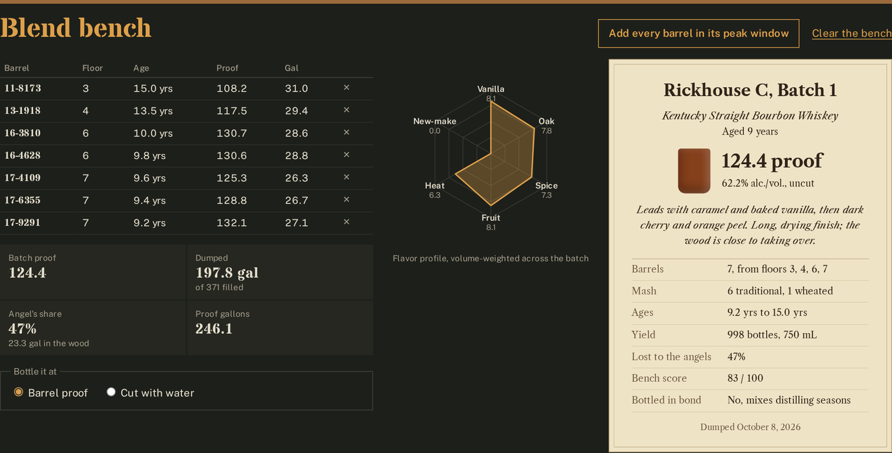

# Stillhouse

A bourbon distillery simulator. Design a mash bill in the lab, fill barrels with it, and watch a seven-story Kentucky rickhouse age them day by day on real heat and humidity. Then pick barrels across floors and ages, and the blend bench works out batch proof, yield, a flavor profile and a label-style spec sheet.

Built with C# and Blazor WebAssembly on .NET 10. It runs entirely in the browser with no server and no database.

**[Live demo](https://saedarm.github.io/Stillhouse/)**



## What it does

**The mash lab.** Build a recipe from seven grains (yellow corn, blue corn, rye, wheat, malted barley, oats, smoked malt), pick a yeast, set fermentation time, temperature and sour mash, choose a column or pot still, the proof off the still and into the barrel, and the char level. Start from a classic style or press **Surprise me** for a random one. You get:
- The legal classification, checked rule by rule (bourbon needs 51% corn, 160 proof or lower off the still, 125 or lower into the barrel, new charred oak). Break a rule and it tells you what it's called instead: rye whiskey, wheat whiskey, malt whiskey or plain American whiskey.
- A style name (high-rye, wheated, four-grain, smoked, oat, blue corn) and a generated nickname you can keep or rename.
- A new-make flavor wheel: sweet, spice, bread, nutty, fruit, floral, smoke and bite.
- Yield in proof gallons per bushel, and how many barrels a 1,000-bushel mash fills. Too little malted barley and the starch doesn't convert, so yield drops.
- A projection of how that recipe ages on every floor, compared with a traditional mash.
- A button to fill a real barrel with it in the rickhouse.



**The rickhouse.** A cross-section of a seven-story warehouse. Each floor is colored by that week's temperature. Each circle is a barrel head, and brighter heads are closer to their flavor peak. Click a floor to see its climate and barrels, or click a barrel to open it.

**The calendar.** Scrub from 2012 to 2040, or press Play and watch the seasons roll through the building. A year-long heat map (floors × weeks) sits underneath; click any week to jump to it.

**The barrel inspector.** For any barrel, along with its fill date, entry proof, char and mash:
- A "when to dump it" curve over 20 years, with the flavor peak and the point where you get the most good whiskey (score × gallons left).
- The same barrel's curve if it had been filled on each of the other six floors.
- Proof over time, which climbs on the upper floors and falls on the lower ones.
- A cross-section of the stave showing how far the spirit is pushed into the char and red layer this week.

**The blend bench.** Add barrels by hand, or add every barrel that's in its peak window. You get:
- Batch proof, gallons dumped vs. gallons filled, angel's share, and proof gallons
- Bottle count at barrel proof or cut to any proof
- A flavor radar (vanilla, oak, spice, fruit, heat, new-make)
- A printed-label spec sheet with a color swatch, tasting notes, age statement and a bottled-in-bond check



## How the aging works

Every barrel is simulated one day at a time from its fill date. Nothing is scripted; the differences between floors all come out of the climate.

1. **Floor climate.** Outside temperature follows central-Kentucky normals (about 35°F in January, 78°F in July) with random fronts and warm or cold years. Each floor lags behind the outside air, with the ground floor lagging most. Upper floors add heat that rises from below and comes through the tin roof, peaking at the summer solstice. The gravel floor pulls the bottom toward 57°F. Day-to-night swing grows from ±1.5°F on floor 1 to about ±10°F under the roof.
2. **Humidity.** Each floor has the same moisture as the outside air, but warmer air holds more, so relative humidity drops floor by floor: about 76% on the ground floor, 44% at the top.
3. **Soak.** New staves absorb about 3 gallons in the first few months (a little more with #4 char).
4. **Angel's share.** Water evaporates through the wood in proportion to how dry the air is. Ethanol evaporates regardless of humidity. The two balance near 62% humidity, so barrels on dry upper floors gain proof and barrels on damp lower floors lose it. Both rates roughly double for every 22°F.
5. **Breathing.** Warm days push spirit into the wood and cool nights pull it back. Each day's movement is counted as twice the day-to-night swing plus the change from yesterday. How deep the spirit goes depends on the temperature.
6. **Extraction.** Vanillin, tannin and spice come out of fixed supplies in the wood. They come out faster with more breathing, deeper penetration and higher temperature, and slow down as the supply runs low. The char strips out the harsh new-make sulfur notes. Fruity esters build slowly from oxidation, faster as the barrel loses volume and takes in air. As spirit evaporates, everything left behind gets more concentrated.

**The recipe carries into the barrel.** The mash sets five things the aging physics uses: how sweet the vanilla reads (corn), how much spice builds (rye and smoke), how much fruit the esters bring (yeast, fermentation, pot still), how hard the oak grips (wheat and oats soften it), and how much new-make bite the char has to strip out (hot ferments, low still proof). A traditional 75/13/12 mash is the neutral reference, so the rest of the model's calibration holds. Char #1 through #4 changes how much vanilla and spice the wood holds, how much it soaks up, and how fast it strips the harsh notes.

A barrel's score rewards vanilla, fruit and spice, tolerates oak up to a point, and penalizes new-make harshness, oak that outruns the vanilla, very high proof, and barrels that have lost almost half their volume.

**Calibration.** The constants were tuned so that a 125-proof fill on the top floor reaches about 136 proof by year 8 and peaks at about 8 years, while the same fill on the ground floor drifts down to about 114 proof and keeps improving past 18 years. A batch of 9- to 15-year barrels loses roughly 40–50% to the angels. These match industry rules of thumb, not any one distillery's data.

## Label rules on the bench

- **Straight bourbon:** every barrel is at least 2 years old.
- **Age statement:** the youngest barrel in the batch.
- **Bottled-in-bond:** one distilling season (January–June or July–December of one year), at least 4 years old, bottled at exactly 100 proof.
- **Single barrel:** one barrel on the bench.
- **Mash:** the spec sheet lists the recipe, or the mix of recipes, in the batch.

## Run it

```
git clone https://github.com/saedarm/Stillhouse.git
cd Stillhouse
dotnet run
```

Then open http://localhost:5180. You need the [.NET 10 SDK](https://dotnet.microsoft.com/download/dotnet/10.0). See [BUILD.md](BUILD.md) for the full build guide, publishing, GitHub Pages setup and troubleshooting.

## Project layout

```
Stillhouse/
├── Model/
│   ├── Climate.cs        weather and the seven floor climates, 2008–2046
│   ├── Barrel.cs         the daily aging physics, flavor axes and dump score
│   ├── MashBill.cs       grains, yeasts, recipes, classification, new-make and yield
│   └── Rickhouse.cs      seeds the warehouse, fills lab barrels; BlendResult does the bench math
├── Components/
│   ├── Warehouse.razor   the cross-section
│   ├── YearHeat.razor    floors × weeks heat map
│   ├── FloorPanel.razor  floor climate and barrel list
│   ├── BarrelPanel.razor dump curve, proof chart, stave cross-section
│   ├── BlendBench.razor  bench, bottling, spec sheet
│   ├── MashLab.razor     the recipe builder, mash ticket and aging preview
│   ├── Dial.razor        labeled slider with a legal-limit marker
│   ├── Radar.razor       flavor radar
│   └── Draw.cs           heat color ramp and SVG helpers
├── App.razor             page state, tabs and the calendar
└── wwwroot/              host page and styles
```

The physics in `Model/` has no Blazor dependencies, so you can lift it into a console app or a test project as-is.

## License

[MIT](LICENSE)
